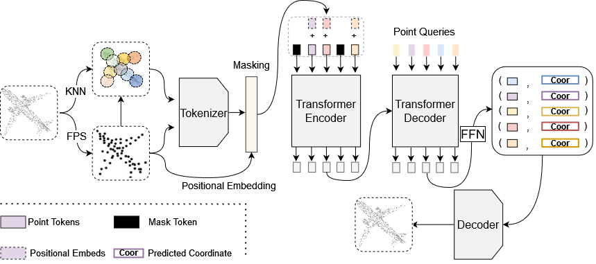
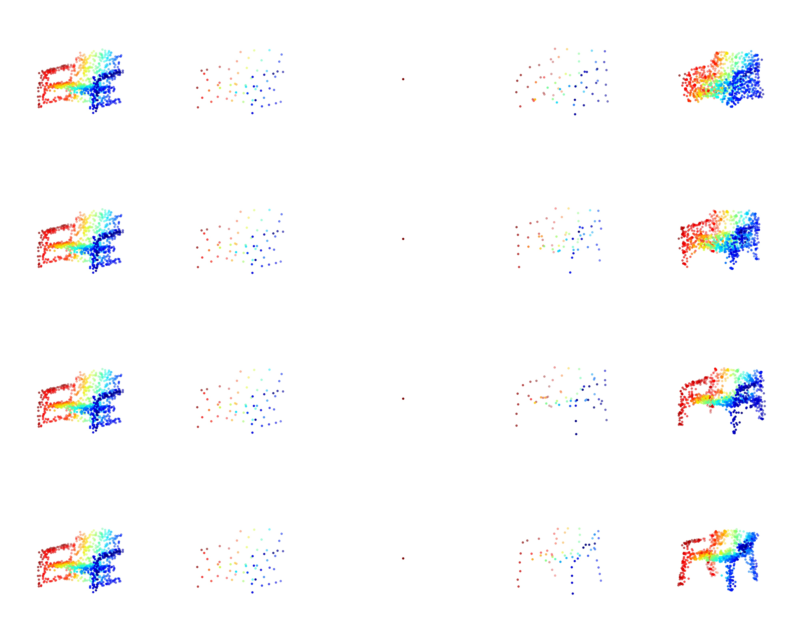

# MaskGPCT: Masked Generative Point-Cloud Transformer

## Summary
MaskGPCT is a new paradigm for point clouds generation, inspired by [MaskGIT](https://github.com/google-research/maskgit). The new paradigm brings the parallel decoding power of bidirectional transformers to point cloud generation and completion. At inference time, the model is able to generate a point-cloud  in a constant amount of iterations.



    
## Pretrained Models

### dVAE
Pre-trained dVAE was taken from [Point-BERT](https://github.com/lulutang0608/Point-BERT). See their repo for more information.

### MaskGPCT
Pre-trained MaskGPCT is coming soon...


## Usage

### Requirements

- PyTorch == 1.7.0
- python == 3.7
- CUDA == 10.2
- GCC >= 4.9 
- torchvision
- timm
- open3d
- tensorboardX

```
pip install -r requirements.txt
```


#### Building Pytorch Extensions for Chamfer Distance, PointNet++ and kNN

*NOTE:* PyTorch >= 1.7 and GCC >= 4.9 are required.

```
# Chamfer Distance
bash install.sh
# To install the required chamfer files:
cd extensions/chamfer_dist
python setup.py install --user
# PointNet++
pip install "git+https://github.com/erikwijmans/Pointnet2_PyTorch.git#egg=pointnet2_ops&subdirectory=pointnet2_ops_lib"
# GPU kNN
pip install --upgrade https://github.com/unlimblue/KNN_CUDA/releases/download/0.2/KNN_CUDA-0.2-py3-none-any.whl

```

### Training and Inference
Please note: distributed training is not yet tested and might not work yet!

For training MaskGPCT's transformer, simply run:
```
bash scripts/train_MaskGPCT.sh <NUM_GPU> <port> \
    --config cfgs/Mixup_models/MaskGPCT.yaml \
    --exp_name <name>
    [--val_freq 10]
```
when the tensorboard will be loaded with a sample of the model generation every val_freq epochs.

For resuming training stopped by accident:
```
bash scripts/train_MaskGPCT.sh <NUM_GPU> <port> \
    --config cfgs/Mixup_models/MaskGPCT.yaml \
    --exp_name <name> \
    --ckpts <path> \
    --resume \
    [--val_freq 10]
```

For generation or completion tasks, simply run:
```
bash scripts/generate.sh <GPU_IDS>\
    --config cfgs/Mixup_models/generator.yaml \
    --ckpts <ckpts path> \
    --exp_name <name>
```
For completion, change completion to True at the file "cfgs/Mixup_models/generator.yaml". The number of decoding iteration can also be set there

### Dataset

We use **ShapeNet** for the MaskGPCT model.

The details of used datasets can be found in [DATASET.md](./DATASET.md).


### Visualization
Some visualizations of generation of the model trained on the chair category. All generations are conditioned on the same single coordinate and token, and inferenced in 10 iteration steps.

From left to right: ground truth cloud, ground truth centers, sampled center used as an input, predicted ceneters, predicted cloud 




## 📢 Shout-outs
Some of the code in this repo is borrowed from [Point-BERT](https://github.com/lulutang0608/Point-BERT). In addition, many ideas in this project were also inspired from [MaskGIT](https://github.com/google-research/maskgit) and [DETR](https://github.com/facebookresearch/detr). We thank the authors for their great work!


## TODO
- [X] Provide visual results of point-cloud conditioned generation task
- [ ] Supply matching known tokens for completion tasks 
- [ ] Take care of the case of generation multiple clouds at a single decoding precedure
- [ ] Add unconditional generation
- [ ] Test distributed training (currently not tested and might not work)
- [ ] Try image conditioned generation


Created by [Moran Yanuka](https://github.com/moranyanuka)
